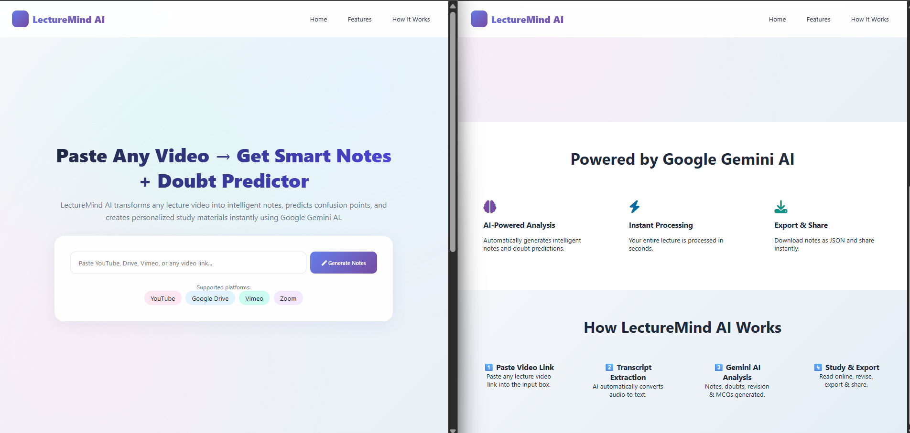
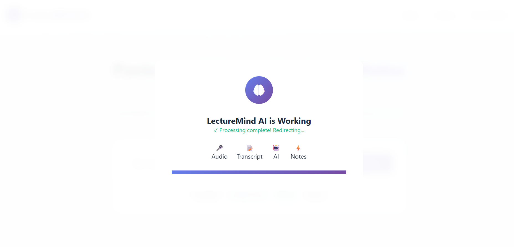
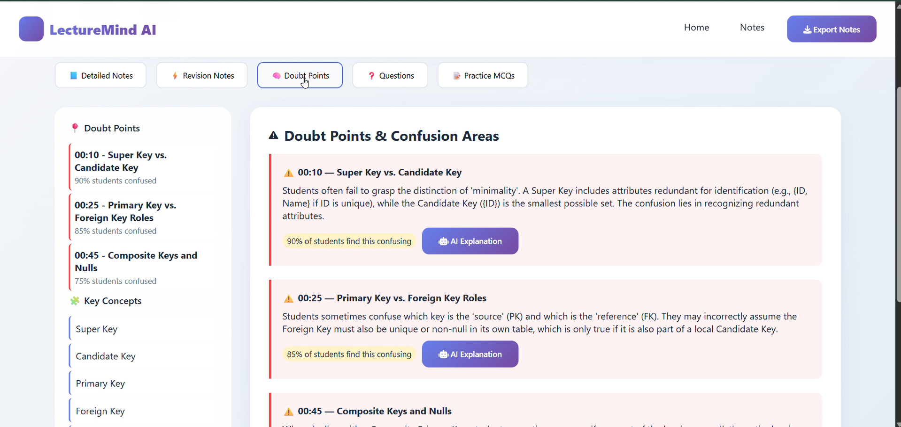

 # 🧠 LectureMind AI  
### Paste Any Lecture Video → Get Smart Notes, Doubt Prediction & Practice Toolkit

> LectureMind AI is an AI-powered full-stack web application that transforms lecture videos into **structured notes, revision summaries, doubt prediction, and exam-oriented practice material** using **Google Gemini AI**.

---

## 🚀 Project Overview

**LectureMind AI** is designed for students, educators, and EdTech platforms.  
It analyzes lecture videos and automatically generates intelligent learning content, helping students focus on **what really matters** and **where confusion usually occurs**.

This project demonstrates **real-world AI integration**, **prompt engineering**, **clean UI/UX**, and **production-level backend design**.

---

## ✨ Key Features

### 🎥 Video → Knowledge Pipeline
- Paste any lecture video link (YouTube supported)
- Automatically extracts transcript
- Falls back to video metadata when transcript is unavailable

### 🧠 AI-Powered Lecture Analysis
- Generates **structured HTML-based detailed notes**
- Creates **short revision-friendly summaries**
- Extracts **key concepts**
- Produces **exam-oriented important questions**

### 📌 AI Doubt Predictor (Unique Feature)
- Identifies **concepts where students usually get confused**
- Predicts **confidence level (%) of confusion**
- Helps students focus on weak areas efficiently

### 📝 Exam & Practice Toolkit
- Auto-generated **MCQs**
- Answer validation with **instant feedback**
- Detailed explanations for better understanding

### 📤 Export & Share
- Export lecture analysis as **JSON**
- Print-friendly notes layout
- Shareable lecture links

---

## 🖥️ Tech Stack

### 🔧 Backend
- **Python (Flask)** – REST-based backend
- **Google Gemini AI** – Content analysis & generation
- **YouTube Transcript API** – Lecture transcript extraction
- **UUID & In-memory Cache** – Session-based lecture storage

### 🎨 Frontend
- **HTML5 + CSS3** (Glassmorphism UI)
- **Vanilla JavaScript (OOP-based architecture)**
- **Font Awesome Icons**
- Fully responsive design

### 🤖 AI & Processing
- Prompt-engineered Gemini AI responses
- Strict JSON output handling
- Structured AI output for direct UI rendering

---

## 🧩 System Architecture

User Video URL
↓
Transcript Extraction
↓
Gemini AI Analysis
↓
Notes + Doubts + MCQs
↓
Interactive Study Dashboard

---
### 🔹 Home Page

### 🔹 AI Processing

 

### 🔹 Doubt Predictor

## 👥 Team DNA >> Akash kumar & Ajeet yadav

LectureMind AI was built by a , working end-to-end on ideation, development, and execution.

- **System & AI Architect**
  - Defined the core product vision and AI-driven feature set
  - Built the backend system and integrated Gemini AI
  - Optimized prompt design to produce structured, exam-ready outputs

- **Product & Frontend Engineer**
  - Transformed AI output into a polished, production-ready UI
  - Designed user flows for fast learning and revision
  - Implemented real-time interactions and study tools

> This collaboration mirrors real-world engineering teams, balancing **innovation, usability, and scalability**.

